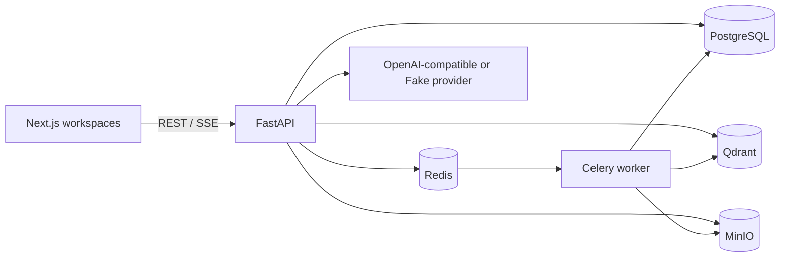

# Architecture

PostgreSQL is authoritative for users, memberships, documents, chunks and audit data. Qdrant is a derived candidate index and never authorizes access. The retrieval service derives memberships from the authenticated user before querying Qdrant, injects only those `space_id` values into both dense and sparse queries, then joins memberships and documents again before returning results. Document IDs, creation dates, file types, ready state and deletion state are all rechecked from PostgreSQL; Qdrant payload is not returned as authoritative content. Object storage is private and originals are never served by a public bucket.

The Agent graph is `security check → hybrid search → authorized chunk read → sufficiency check → answer/refuse → trace`. It has two read-only tools in the implemented path and remains below the four-call limit. Dense and sparse candidate ranks are fused deterministically with RRF (`k=60`); a bounded lexical coverage, frequency and exact-phrase score supplies the lightweight rerank baseline. Chunk reads independently repeat the PostgreSQL membership and ready-document checks.

The public REST and tool contracts are unchanged. Internally, retrieval accepts an authenticated `user_id` instead of caller-supplied space IDs so clients, model output and stale agent state cannot choose the authorization scope. See [retrieval design](10-retrieval.md).

Compose is the deployment unit for V1. API and worker are stateless; PostgreSQL, Qdrant and MinIO own persistent volumes and can later move to managed equivalents.
