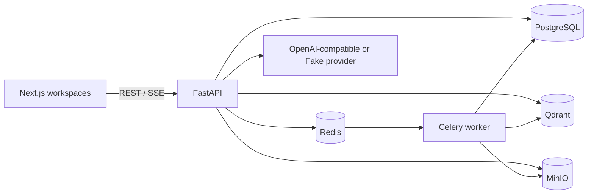

# Architecture

PostgreSQL is authoritative for users, memberships, documents and audit data. Qdrant is a derived index and never authorizes access: the API calculates memberships first and injects `space_id` filters into every query. Object storage is private and originals are never served by a public bucket.

The Agent graph is `security check → hybrid search → authorized chunk read → sufficiency check → answer/refuse → trace`. It has two read-only tools in the implemented path and remains below the four-call limit. Dense and sparse candidates are fused with RRF; lightweight lexical overlap provides the initial rerank baseline.

Compose is the deployment unit for V1. API and worker are stateless; PostgreSQL, Qdrant and MinIO own persistent volumes and can later move to managed equivalents.

