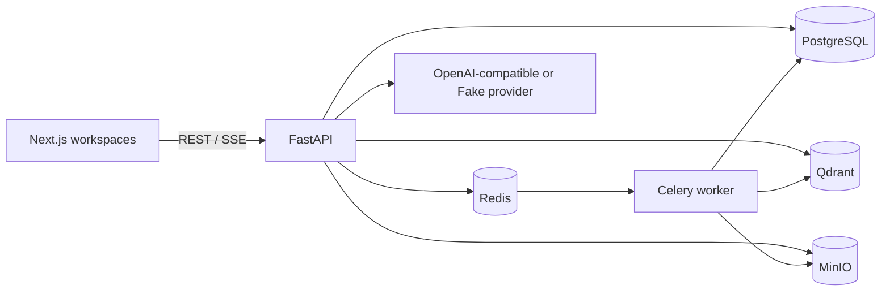

# Architecture

PostgreSQL is authoritative for users, memberships, documents, chunks and audit data. Qdrant is a derived candidate index and never authorizes access. The retrieval service derives memberships from the authenticated user before querying Qdrant, injects only those `space_id` values into both dense and sparse queries, then joins memberships and documents again before returning results. Document IDs, creation dates, file types, ready state and deletion state are all rechecked from PostgreSQL; Qdrant payload is not returned as authoritative content. Object storage is private and originals are never served by a public bucket.

The Agent graph is `security check → hybrid search → authorized chunk read → sufficiency check → answer/refuse → trace`. These are explicit LangGraph nodes. The only tools are the existing read-only `search_knowledge` and `read_chunks` functions; each normal run calls both once, while a hard budget rejects any attempt above four calls. Authenticated user ID, authorization scope and filters are held in server closures. Chunk IDs passed to `read_chunks` are copied only from server-side search results, never from the client or model.

The same graph emits typed incremental events for synchronous chat and SSE. The synchronous endpoint consumes the stream to completion; the streaming endpoint forwards it as it happens. Fake Provider output is split into deterministic evidence units, so tests exercise real event ordering without an external model. Dense and sparse candidate ranks are fused deterministically with RRF (`k=60`); a bounded lexical coverage, frequency and exact-phrase score supplies the lightweight rerank baseline. Chunk reads independently repeat the PostgreSQL membership and ready-document checks. See [Agent design](11-agent.md).

The public REST and tool contracts are unchanged. Internally, retrieval accepts an authenticated `user_id` instead of caller-supplied space IDs so clients, model output and stale agent state cannot choose the authorization scope. See [retrieval design](10-retrieval.md).

Compose is the deployment unit for V1. API and worker are stateless; PostgreSQL, Qdrant and MinIO own persistent volumes and can later move to managed equivalents.

Week 5 adds a versioned evaluation layer around the existing graph rather than a second RAG
implementation. PostgreSQL stores suite metadata, trusted acting-user bindings, run configuration
snapshots, aggregate metrics and redacted per-case outcomes. Each case runs in an isolated database
session with the Fake Provider by default; failures are converted into safe outcomes and do not
stop later cases. The local CLI supplies an in-memory deterministic candidate index, while the
production search and PostgreSQL authorization joins remain unchanged.

Week 6 keeps this topology and adds cross-cutting controls rather than a second platform.
Content-free, low-cardinality metrics cover ingestion transitions, queue events, retrieval stages,
Agent nodes, Provider outcomes, evaluation Gates, refusals, citations, security failures and
dependency readiness. Request IDs and Agent trace IDs are safe UUID correlation values in headers
and redacted traces; they are not metric labels. `/health/live` does not touch dependencies, while
`/health/ready` checks PostgreSQL, Redis, Qdrant and MinIO and returns only ready/unavailable codes.

The authenticated operations summary exposes readiness, the most recent persisted evaluation Gate
and aggregate 24-hour failed/refusal counts. It never exposes topology, content, filenames,
invisible citations, raw errors or high-cardinality identifiers. PostgreSQL remains authoritative;
Qdrant and MinIO are checked as derived/index and object projections.
